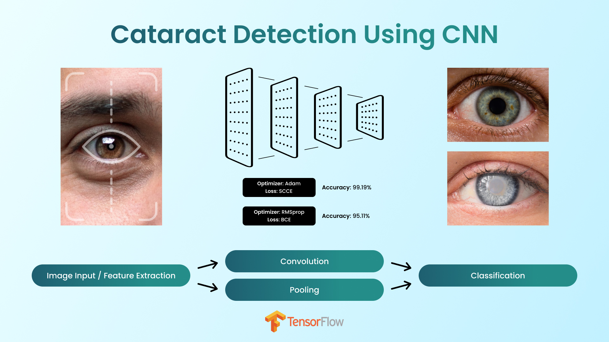
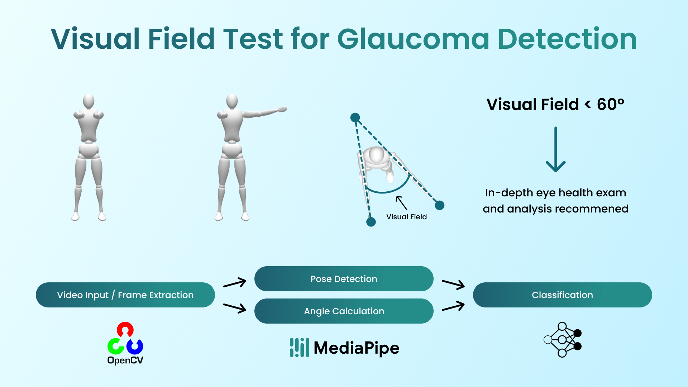
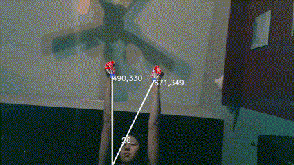

# VisionGuardian's Source Code

This repository includes the source code for the cataract + glaucoma detection for the VisionGuardian project, providing users with an easy way to self-diagnose their eye health.

* **Cataract detection** was achieved by utilizing TensorFlow to create an image classification model (more specifically, a convolutional neural network).
* **Glaucoma detection** was achieved by using OpenCV & MediaPipe to leverage computer vision and create an object tracker and pose detector. 

# Cataract Detection

### Source Code

The source code for cataract detection was written in a Jupyter Notebook and can be found at [`src/Cataract/cataract_cnn.ipynb`](src/Cataract/cataract_cnn.ipynb).

### Dataset

The cataract image dataset used for classification originated from [Kaggle](https://www.kaggle.com/datasets/nandanp6/cataract-image-dataset).

### CNN Models

- **Model 1**: Adam Optimizer + Sparse Categorical Cross Entropy Loss.
  - Loss: `0.0499`
  - Accuracy: `0.9919`
  - Total parameters: `36,162`
- **Model 2**: RMSprop Optimizer + Binary Cross Entropy Loss.
  - Loss: `0.1422`
  - Accuracy: `0.9511`
  - Total parameters: `1,086,689`

# Glaucoma Detection

### Source Code

The source code can be found in [`src/Glaucoma`](src/Glaucoma), separated into different Python scripts along with a requirements file.

### Visual Field Test

This simple test can be used as a potential self-diagnosis for glaucoma. Here are the steps to perform it:
1. Stand straight up, keeping your feet shoulder-width apart.
2. Outstretch your arms in front of you such that they are parallel to the ground.
3. Point your thumbs up towards the ceiling.
4. Keeping your head and eyes still, move one arm away from the center until your thumb is no longer in your field of view.
5. If your visual field (the angle between your arms) is less than 60º, then you may potentially have glaucoma.
6. Reset your stance and repeat the test with your other arm.

